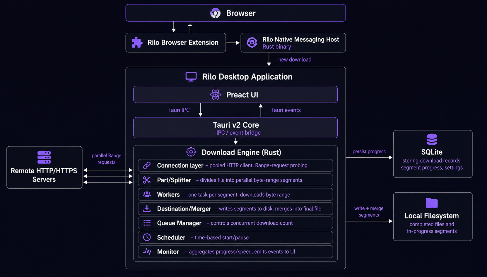
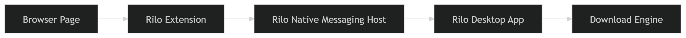
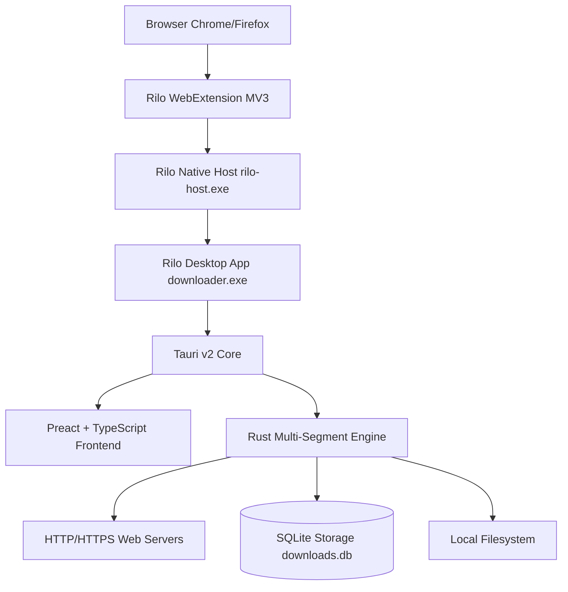
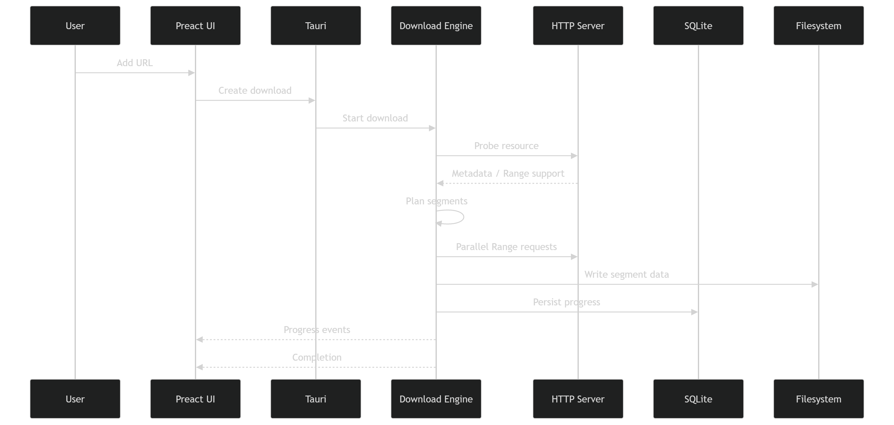

# rilo

**rilo** is a fast, lightweight desktop download manager for Windows. Built for personal use with Rust, Tauri v2, Preact, TypeScript, and SQLite. It handles multi-segment downloads, pause/resume, browser link catching, and simple queue scheduling.

---

## Interface & Overview

### Desktop Download Manager


### Minimal Browser Extension


---

## Key Features

### Download Engine
* **Multi-Segment Parallel Acceleration**: Splits large files into dynamic byte ranges to maximize connection throughput.
* **HTTP Range Pause & Resume**: Pause active downloads at any point and resume seamlessly without losing progress.
* **SQLite Persistence**: Download state, byte progress, metadata, and history persist across application restarts.
* **Crash Recovery**: Active downloads automatically recover and resume after unexpected crashes or network drops.
* **Token-Bucket Rate Limiting**: Global and per-download speed limit controls.
* **Automatic Retry System**: Configurable backoff and retry strategy for interrupted connections.

### Native Desktop UX & Customization
* **Dense Desktop Grid View**: Clean, compact table layout optimized for multi-tasking without excessive padding.
* **Segment Inspector & Details Modal**: Inspect real-time segment progress, byte ranges, individual connection speeds, and HTTP headers.
* **Clipboard URL Import**: Instant URL paste button with automatic URL extraction from surrounding plain text and preservation of signed tokens/fragments.
* **Theme & Appearance Settings**: Full dark/light mode toggle, dynamic accent color selector, custom font stacks (*Inter*, *IBM Plex Sans*, *JetBrains Mono*, *Geist*, *System*), and layout density adjustments.
* **Single-Instance Application**: Windows process locking ensures only one desktop instance runs at a time while handling incoming requests.

### Browser Integration & Native Messaging
* **Chrome & Firefox Extension (Manifest V3)**: Compact `~320px` popup with a primary `Catch Links` toggle.
* **Native Messaging Host (`com.rilo.downloader`)**: Directly connects browser events to Rilo without polling.
* **Automatic Application Startup**: If Rilo is closed when a download is requested from the browser, the native host automatically launches Rilo, waits for IPC endpoint readiness, and forwards the URL safely.
* **Right-Click Context Menu**: Explicit *"Download with Rilo"* context menu item functions regardless of whether auto-catching is enabled.

### Queue & Scheduler
* **Category Organization**: Automatic and custom categories (*Documents*, *Archives*, *Video*, *Audio*, *Software*).
* **Queue Scheduler**: Configure daily or time-based automated download starts and pauses.

### Archive Handling & Post-Download Actions
* **Automatic Archive Extraction**: Native extraction support for `.zip`, `.tar.gz`, `.7z`, `.bz2`, and `.xz` archives.
* **Zip-Slip Security Protection**: Prevents path traversal vulnerabilities during archive extraction.
* **Post-Completion Actions**: Optional system shutdown, sleep, or exit upon queue completion.

---

## System Architecture



### Architecture Diagram


---

## Build & Installation

### Prerequisites
* [Node.js](https://nodejs.org/) (v18+) & [pnpm](https://pnpm.io/)
* [Rust](https://www.rust-lang.org/) toolchain (1.75+)
* Windows 10/11 x64

### Building from Source

1. **Clone the Repository**:
   ```bash
   git clone https://github.com/kmanisk/rilo.git
   cd rilo
   ```

2. **Install Frontend Dependencies**:
   ```bash
   pnpm install
   ```

3. **Build Frontend**:
   ```bash
   pnpm build
   ```

4. **Build Tauri Desktop Application**:
   ```bash
   cargo build --manifest-path src-tauri/Cargo.toml --release
   ```

5. **Build Native Messaging Host**:
   ```bash
   cargo build --manifest-path src-tauri/Cargo.toml --bin rilo-host --release
   ```

---

## Browser Extension Setup

1. Open Chrome (`chrome://extensions`) or Firefox (`about:debugging`).
2. Enable **Developer Mode**.
3. Click **Load unpacked** and select the `rilo-extension/` directory inside this repository.
4. Launch Rilo desktop application to automatically register native messaging manifests in Windows Registry (`HKCU\Software\Google\Chrome\NativeMessagingHosts\com.rilo.downloader`).

---

## License

This project is licensed under the [MIT License](LICENSE).
