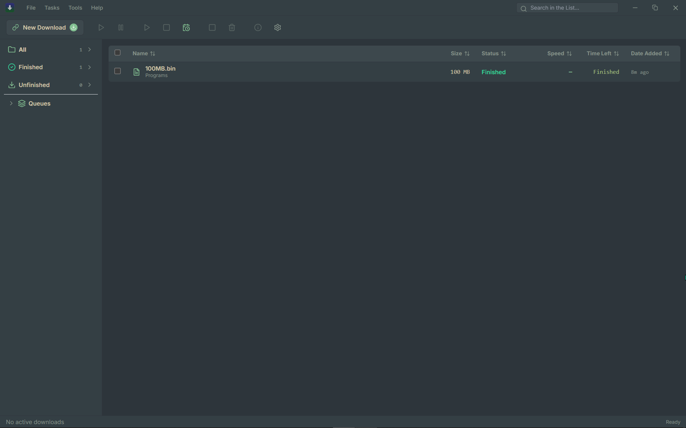
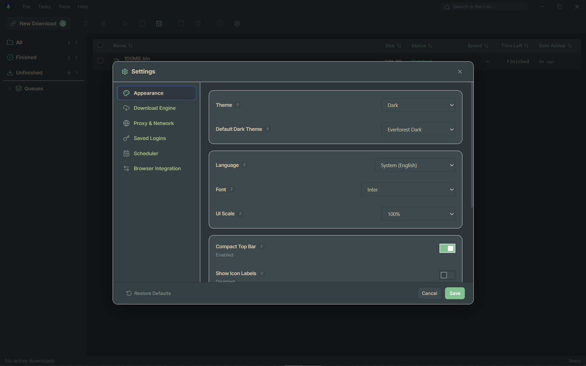

# rilo

**A fast, lightweight, and modern desktop download manager for Windows.**

[](https://github.com/kmanisk/rilo/releases/latest)
[](LICENSE)
[](https://github.com/kmanisk/rilo)
[](https://github.com/kmanisk/scoop-bucket)

[Download](#download) | [Features](#features) | [Install Guide](#install-guide) | [Browser Extension](#browser-extension) | [Architecture](#architecture) | [Build from Source](#build-from-source) | [License](#license)

---




---

## What is Rilo?

**Rilo** is a high-performance, open-source download manager built with **Rust**, **Tauri v2**, **Preact**, **TypeScript**, and **SQLite**. Designed as a modern alternative to bloated, ad-ridden download utilities, Rilo provides dynamic multi-connection acceleration, rock-solid crash resilience, automated queue scheduling, and seamless browser integration in a clean, high-density desktop interface.

---

## Features

### Speed & Performance
* **Dynamic Multi-Segment Acceleration**: Automatically splits files into parallel byte-range connections to saturate available network bandwidth.
* **Bandwidth Throttling**: Global and per-download token-bucket rate limiting to maintain smooth browsing while downloading.
* **Connection Pooling**: Optimized HTTP/HTTPS socket reuse for fast response times.

### Reliability & Resilience
* **HTTP Range Pause & Resume**: Pause active downloads at any moment and resume without data corruption or loss.
* **SQLite-Backed State Persistence**: Byte offsets, progress logs, and metadata are saved in real-time, surviving sudden crashes or OS reboots.
* **Automatic Retry System**: Configurable exponential backoff to recover from transient network drops and server errors.

### Scheduling & Automation
* **Automated Queue Scheduler**: Schedule daily or customized time windows for automated download starts and pauses.
* **Post-Download Actions**: Automatically trigger system shutdown, sleep, or exit once all downloads complete.
* **Archive Auto-Extraction**: Automatically extracts `.zip`, `.rar`, `.7z`, `.tar.gz`, `.bz2`, and `.xz` archives upon completion with Zip-Slip path sanitization.

### Organization & File Management
* **Hierarchical Category Folders**: Automatically organizes completed files into dedicated `Rilo/<Category>` subfolders (*Compressed*, *Programs*, *Videos*, *Music*, *Pictures*, *Documents*, *Other*).
* **Clipboard Auto-Detection**: Instant URL detection and parsing directly from clipboard text with preservation of tokens and query parameters.
* **Custom Save Locations**: Per-download destination and directory overrides.

### Interface & Customization
* **Dense Desktop Grid View**: Compact, high-information table layout designed for power users without unnecessary whitespace.
* **Segment Progress Visualizer**: Real-time visual representation of active connection segments, speeds, and byte boundaries.
* **Curated Themes & Fonts**: Full dark/light theme presets, customizable accent colors, and support for system/custom font stacks (*Inter*, *Geist*, *IBM Plex Sans*, *JetBrains Mono*).

### Ecosystem & Integration
* **Native Messaging Extension**: Manifest V3 extension for Chrome and Firefox with one-click link interception and context menu options.
* **Zero-Latency Wakeup**: Automatically launches the desktop application in the background when a download is initiated from the browser.

---

## Download

| Platform | Package | Architecture | Download |
| :--- | :--- | :--- | :--- |
| **Windows** | NSIS Installer (`.exe`) | `x64` | [Download Installer (`Rilo_1.1.0_x64-setup.exe`)](https://github.com/kmanisk/rilo/releases/latest) |
| **Windows** | Standalone Portable (`.exe`) | `x64` | [Download Portable (`Rilo_1.1.0_x64-portable.exe`)](https://github.com/kmanisk/rilo/releases/latest) |
| **Windows** | Scoop Package | `x64` | `scoop install rilo/rilo` |

---

## Install Guide

### Via Scoop (Recommended)

Install and keep Rilo automatically updated via [Scoop](https://scoop.sh/):

```powershell
# 1. Add the Rilo bucket
scoop bucket add rilo https://github.com/kmanisk/scoop-bucket

# 2. Install Rilo
scoop install rilo/rilo
```

To update or uninstall:
```powershell
scoop update rilo       # Update Rilo
scoop uninstall rilo    # Uninstall Rilo
```

### Manual Installation

1. Download `Rilo_1.1.0_x64-setup.exe` from [GitHub Releases](https://github.com/kmanisk/rilo/releases/latest).
2. Run the installer and follow the setup wizard.
3. Launch Rilo from the Start Menu or Desktop shortcut.

---

## Browser Extension

| Browser | Status | Installation Method |
| :--- | :--- | :--- |
| **Google Chrome / Chromium / Brave / Edge** | Supported (MV3) | [Load Unpacked / Release Zip](https://github.com/kmanisk/rilo/releases/latest) |
| **Mozilla Firefox** | Supported (MV3) | [Load Temporary Add-on](https://github.com/kmanisk/rilo/releases/latest) |

### Setup Instructions

1. Download `rilo-extension.zip` from the [latest release](https://github.com/kmanisk/rilo/releases/latest) and extract it (or use the `rilo-extension/` directory).
2. In Chrome, navigate to `chrome://extensions`, enable **Developer mode**, and click **Load unpacked**.
3. In Firefox, navigate to `about:debugging#/runtime/this-firefox` and click **Load Temporary Add-on**.
4. Launch the Rilo desktop app once to register the native messaging host in the Windows Registry (`HKCU\Software\Google\Chrome\NativeMessagingHosts\com.rilo.downloader`).

---

## Architecture

| Component | Technology | Description |
| :--- | :--- | :--- |
| **Core Engine** | Rust (`dlengine`) | Multi-segment parallel streaming, range requests, token-bucket rate limiting |
| **Application Shell** | Tauri v2 | Lightweight native webview bridge with single-instance named pipes |
| **Frontend UI** | Preact + TypeScript + Tailwind CSS | High-density, reactive user interface with zero runtime bloat |
| **Persistence** | SQLite (`sqlx`) | ACID-compliant transaction storage for tasks, metadata, and history |
| **Browser Host** | Rust Native Messaging | Standard I/O bridge connecting browser extensions to the desktop daemon |
| **Decompression** | Rust Archive Utilities | Safe, multi-format extraction engine with Zip-Slip path sanitization |

---

## Build from Source

### Prerequisites
* [Node.js](https://nodejs.org/) (v18+) & [pnpm](https://pnpm.io/)
* [Rust](https://www.rust-lang.org/) toolchain (1.75+)
* Windows 10/11 x64

### Steps

```bash
# Clone the repository
git clone https://github.com/kmanisk/rilo.git
cd rilo

# Install frontend dependencies
pnpm install

# Run development server
pnpm tauri dev

# Build production NSIS installer
pnpm tauri build
```

---

## Documentation

| Document | Description |
| :--- | :--- |
| [Release Notes](https://github.com/kmanisk/rilo/releases) | Detailed changelog and version history |
| [Scoop Bucket](https://github.com/kmanisk/scoop-bucket) | Manifests and packaging definitions for Scoop |
| [License](LICENSE) | MIT open-source license terms |

---

## Contributing

Contributions, feature requests, and bug reports are welcome! Please feel free to open an issue or submit a pull request on the [GitHub Repository](https://github.com/kmanisk/rilo).

---

## License

This project is licensed under the [MIT License](LICENSE).
